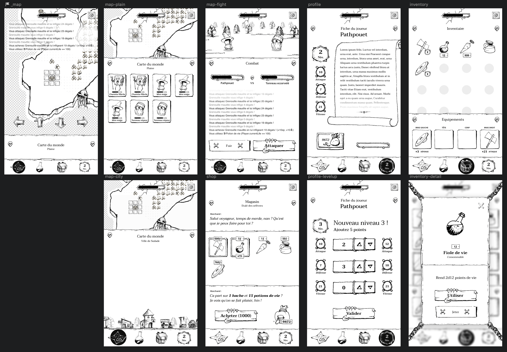

# SWClone

2D MMORPG, fight mobs, gain experience, deal with merchants and compare your big
stuff with your friend.



## Front

This project use VueJS and Vuex (no so implemented) with a standard VueCli config.
SCSS is available for stylesheets.

### Project setup
```
npm install
```

### Compiles and hot-reloads for development
```
npm start
```

### API - Serve the world (required)

Run the `json-server` API with:

```
npm run back
```

## Overview

### Components

- **App:** Navigation and `router-view`, all routes are avalable in `src/main.js`
- **Game:** Contain most of the game logic. Also the container for game components like `Map` or `Place`
- **Logger:** Receive an Array of logs to display while playing, received damage, position change, or drinking potion must trigger a log.
- **Sidebar:** Display mostly the player informations, avatar, name, level etc… and some shortcuts (like drinking potion)
- **Map:** Display the map cells on a grid and allow the player to move.
- **Place:** Display all visible mobs and enemies. Can also display a customized city place.
- **City:** Display some actions for now, but next there will be buildings and specific actions.

### Admin Components

- **MapEditor:** Display the map to be edited. Change mobs, cell type.
- **ItemEditor:** List all available items, and allow to edit all their stats, their picture…
- **MobEditor:** List all available mobs, and allow to edit all their stats, their picture…

## Some docs

- [Enemies inspiration](http://nintendo.wikia.com/wiki/List_of_EarthBound_enemies)
- [Inventory example](https://codepen.io/MadLittleMods/pen/vmhLF)
- [How to newtwork?](http://www.plinkojs.com/about)
- [What's ECS](https://www.reddit.com/r/gamedev/comments/afmi3v/game_objects_creation_incode_or_json/edzxdel/) OR [This](http://iolivia.me/posts/entity-component-system-explained/) OR [This](https://skypjack.github.io/2019-02-14-ecs-baf-part-1/)
- [EventBus](https://alligator.io/vuejs/global-event-bus/) OR Vuex
- [vue-global-events](https://github.com/shentao/vue-global-events)
